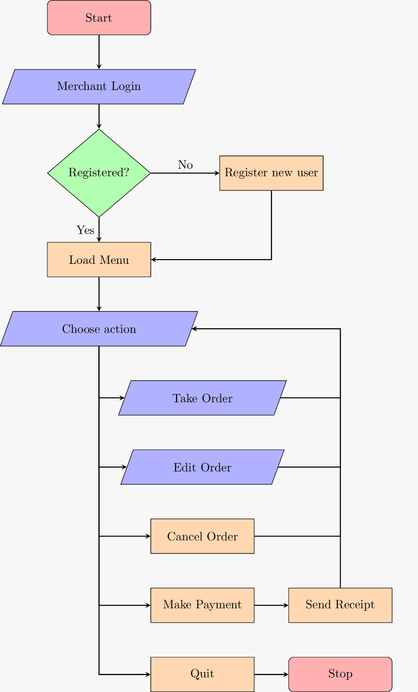

# Digital Receipt System
**C Project Extension** - Computing Year 1, Imperial College London.\
Developed by Zirun Zhai, Ivy Tam, Soon Zhi Ho (Brandon), Wei Yi Tee.

**Project Summary:**\
Designed to eliminate the need of paper receipts. \
Our program enables merchants to take and manipulate orders from customers; after an order is paid, the receipt can be issued via email to the customer. 

## Usage
_Notes: Email login as the sender currently only works for limited email accounts due to security reasons_

 
1. Run `make merchant`
2. `./merchant` without any arguments runs the program in interactive mode
	1. **Login - merchant prompted for an ID**
	  *  New ID: Prompt for registration with password (hashed and stored with ID in merchantID.txt)
	  *  Existing ID: Prompt for password which will be checked against stored hash
	2. **Setting sender email**
	  * Merchant will be prompted for an email address and password from where receipts are sent to customers
	  * Authentication currently only works for gmail accounts which allow access from less secure apps
	3. **Menu loaded, merchant actions:**
	  * Each merchant has their own folder (id as folder name, stored in Merchants folder) which stores a record of receipts and the merchant's menu of items to sell (currently only supports addition by manually moving a menu text file into the folder)
	  * After successful login, the menu will be loaded and the merchant can select actions to be carried out by inputting the action's corresponding number as follows :\
	  **[0] Quit program\
    [1] Take new order\
    [2] Edit order\
    [3] Cancel order\
    [4] Pay order + Send receipt**

## Testing 

